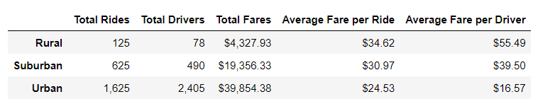
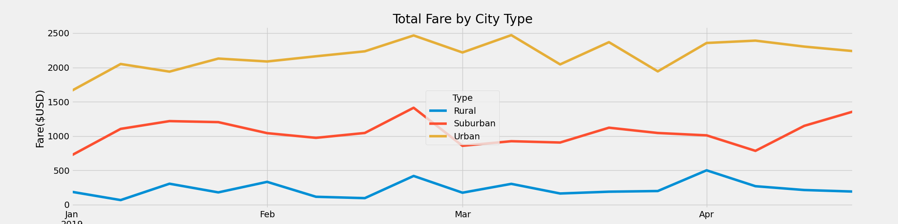

# PyBer_Analysis

## Project Overview
CEO V. Isualize, of the ride sharing company PyBer, has assigned me to perform an exploratory analysis based on two csv files. I have created several types of visualization in order to convey a comprehensive report about the data. This analysis will provide PyBer with the necessary insights to improve access to ridesharing services and determine affordability for underserved neighborhoods.
## Resources
- Data Source: city_data.csv, ride_data.csv
- Software: Anaconda 2022.10, Python 3.7.6, Jupiter Notebook 6.4.12, Pandas 1.3.5, Matplotlib 3.5.2, NumPy 1.21.5
## Results

The pie chart pictured above illustrates the percentages of rides our customers acquired for each city type during the year 2019. The chart confirms that PyBer has a strong position in urban cities with a 68.4% share of all the rides we serviced. The chart also shows that 26.3% of our rides were purchased in suburban cities, while only 5.3% were purchased in rural cities.

Furthermore, the summary DataFrame pictured above details the stark differences between each city as such:
- Rural cities were serviced with a total of 125 rides, had a total of 78 drivers, and generated $4,327.93 in total fares. The average fare per ride was $34.62, and the average fare per driver was $55.49.
- Suburban cities were provided a total of 625 rides, had a total of 490 drivers, and generated $19,356.33 in total fares. The average fare per ride was $30.97, and the average fare per driver was $39.50.
- Urban cities were supplied a total of 1,625 rides, had a total of 2,405 drivers, and generated $39,854.38 in total fares. The average fare per ride was $24.53, and the average fare per driver was $16.57.

 ##Summary:

The data demonstrates that there were significant contrasts with each city type from January 2019 to April 2019. As one can see on the line chart above; urban, suburban, and rural cities all held their hierarchal classifications of respectively generating the highest, lower, and lowest fare revenue. Increasing the number of drivers in rural and suburban cities would greatly improve their access to ridesharing services. Concertedly, lowering the cost of average fares per ride in rural and suburban cities Would raise the affordability of ridesharing services for the underserved neighborhoods. Lastly, raising the cost of average fares per ride in urban cities—all the while—maintaining the average fare per driver would offset the cost of placing more drivers in rural areas.
